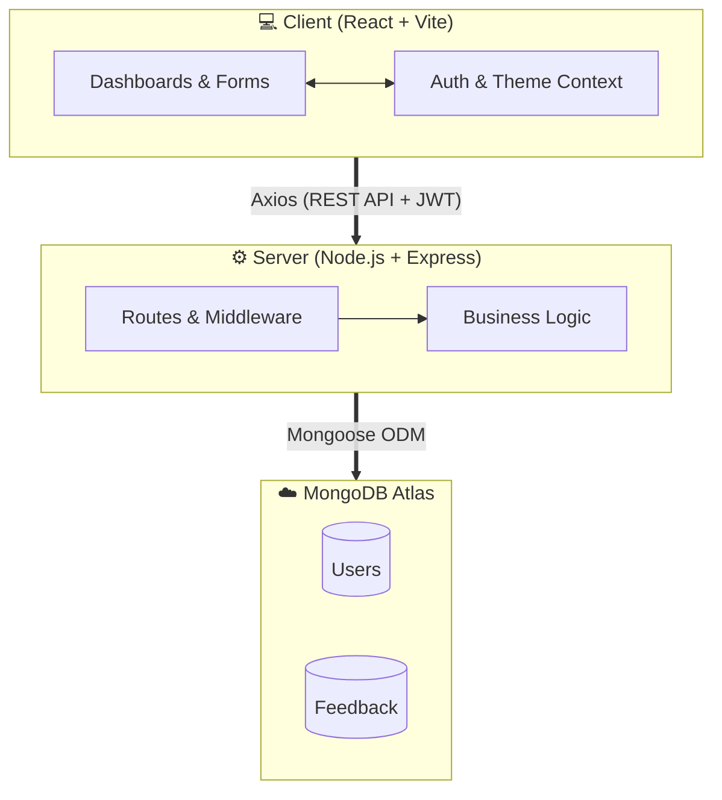

<div align="center">

#  Feedback Collector

### A Full-Stack Feedback Management Platform

[](https://himanshu-singh11.github.io/Feedback-Collector)
[](https://feedback-collector-qwv3.onrender.com/health)
[](https://www.mongodb.com/atlas)

A modern, production-ready web application for collecting, managing, and analyzing user feedback. Built with **React**, **Node.js**, **Express**, and **MongoDB** — featuring role-based access control, dark/light themes, glassmorphism UI, and real-time filtering.

---

</div>

## 📸 Screenshots

> **Add your own screenshots here!** Run the app locally, take screenshots of Login, Dashboard, Admin Panel (both themes), and save them in `frontend/public/screenshots/`.

<!-- 
Uncomment and update paths after adding your screenshots:

### 🔐 Login Page
| Light Mode | Dark Mode |
|:---:|:---:|
|  |  |

### 📊 User Dashboard
| Light Mode | Dark Mode |
|:---:|:---:|
|  |  |

### 🛡️ Admin Dashboard
| Light Mode | Dark Mode |
|:---:|:---:|
|  |  |
-->

---

## ✨ Key Features

### 👤 User Features
- **📝 Submit Feedback** — Interactive emoji-based rating system (😞 😐 😃 🤩) with real-time character counter
- **📋 View My Feedback** — Personal feedback history with expandable message cards
- **🔍 Smart Search** — Real-time search across all feedback fields
- **📅 Date Filtering** — Filter by Today, Last 7 Days, Last 30 Days
- **🔒 Change Password** — In-app password management with visibility toggles
- **🌙 Dark/Light Mode** — Beautiful theme switching with persistent preference

### 🛡️ Admin Features
- **📊 Analytics Dashboard** — Total feedbacks, today's count, and category breakdown
- **📋 Manage All Feedback** — View, search, filter, and delete any user's feedback
- **🕐 Recent Activity** — Live timeline of the latest 5 submissions
- **👁️ Detail View** — Full feedback modal with user metadata and timestamps

### 🎨 UI/UX Highlights
- **Glassmorphism Header** — Frosted glass effect with backdrop blur
- **Mesh Gradient Background** — Dynamic multi-color radial gradients (both themes)
- **Shake Animation** — Form shakes on invalid login credentials
- **Skeleton Loading** — Animated placeholder shimmer during data fetch
- **Toast Notifications** — Slide-in success/error alerts with auto-dismiss
- **Responsive Design** — Fully responsive across all device sizes

---

## 🏗️ Architecture



---

## 🛠️ Tech Stack

| Layer | Technology | Purpose |
|:---:|:---|:---|
| **Frontend** | React 18, Vite, React Router 7 | SPA with fast HMR and modern routing |
| **Styling** | CSS Modules, CSS Variables | Scoped styles with dynamic theming |
| **State** | React Context API, useReducer | Auth state, theme management |
| **HTTP Client** | Axios | Request/response interceptors, auto-auth |
| **Backend** | Node.js, Express.js | RESTful API server |
| **Auth** | JWT (jsonwebtoken), bcryptjs | Token-based auth with password hashing |
| **Database** | MongoDB Atlas, Mongoose | Cloud-hosted NoSQL with ODM |
| **Logging** | Morgan | HTTP request logging |
| **Deployment** | GitHub Pages + Render | Frontend CDN + Backend cloud hosting |

---

## 📡 API Endpoints

### Authentication
| Method | Endpoint | Description | Auth |
|:---:|:---|:---|:---:|
| `POST` | `/api/auth/register` | Register new user | ❌ |
| `POST` | `/api/auth/login` | Login & get JWT token | ❌ |
| `GET` | `/api/auth/profile` | Get current user profile | ✅ |
| `PUT` | `/api/auth/change-password` | Update password | ✅ |

### Feedback
| Method | Endpoint | Description | Auth | Roles |
|:---:|:---|:---|:---:|:---:|
| `GET` | `/api/feedback` | Get feedbacks (scoped by role) | ✅ | User, Admin |
| `GET` | `/api/feedback/:id` | Get single feedback | ✅ | Owner, Admin |
| `POST` | `/api/feedback` | Submit new feedback | ✅ | User, Admin |
| `DELETE` | `/api/feedback/:id` | Delete feedback | ✅ | Owner, Admin |

### Health
| Method | Endpoint | Description | Auth |
|:---:|:---|:---|:---:|
| `GET` | `/health` | Server status check | ❌ |

---

## 🔒 Security Implementation

```mermaid
flowchart TD
    Request(["🌐 API Request"])
    
    subgraph Middleware ["🛡️ Authentication Pipeline"]
        direction TB
        T["1️⃣ Extract JWT Token"]
        V["2️⃣ Verify Signature"]
        U["3️⃣ Fetch User from DB"]
        R["4️⃣ Check Role Access"]
        
        T --> V --> U --> R
    end
    
    Block(["🚫 Blocked (401/403 Error)"])
    Allow(["✅ Allowed (Process Request)"])

    Request ===| "Authorization: Bearer <token>" |==> T
    R ===| "Pass" |==> Allow
    
    T -. "Fail" .-> Block
    V -. "Fail" .-> Block
    U -. "Fail" .-> Block
    R -. "Fail" .-> Block
```

| Security Feature | Implementation |
|:---|:---|
| **Password Hashing** | bcryptjs with salt rounds (10) |
| **JWT Authentication** | Signed tokens with configurable expiration (30d default) |
| **Role-Based Access Control** | `protect` + `authorizeRoles` middleware chain |
| **Data Isolation** | Users can only access/delete their own feedback |
| **Password Exclusion** | Mongoose `select: false` — passwords never leak in API responses |
| **Input Validation** | Schema-level (Mongoose) + middleware-level (validateRequest) |
| **Payload Limiting** | `express.json({ limit: '10kb' })` prevents DOS attacks |
| **Error Sanitization** | Stack traces hidden in production mode |
| **Auto-Logout** | Axios interceptor catches 401 → fires DOM event → clears session |

---

## 📁 Project Structure

```
Feedback-Collector/
├── backend/
│   ├── config/
│   │   ├── db.js              # MongoDB connection
│   │   └── env.js             # Environment variable validation
│   ├── controllers/
│   │   ├── authController.js  # Register, Login, Profile, Change Password
│   │   └── feedbackController.js
│   ├── middleware/
│   │   ├── authMiddleware.js  # JWT verify + Role authorization
│   │   ├── errorHandler.js    # Global error handler
│   │   ├── notFound.js        # 404 handler
│   │   └── validateRequest.js # Input validation
│   ├── models/
│   │   ├── Feedback.js        # Feedback schema (indexed)
│   │   └── User.js            # User schema (hashed passwords)
│   ├── routes/
│   │   ├── authRoutes.js
│   │   └── feedbackRoutes.js
│   ├── services/
│   │   └── feedbackService.js # Business logic layer
│   ├── utils/
│   │   ├── ApiError.js        # Custom error class
│   │   └── ApiResponse.js     # Standardized responses
│   ├── app.js                 # Express app configuration
│   └── server.js              # Server entry point
│
├── frontend/
│   ├── src/
│   │   ├── components/
│   │   │   ├── common/        # Reusable UI (Modal, Toast, SearchBar, Skeleton, etc.)
│   │   │   ├── feedback/      # FeedbackForm, FeedbackList, FeedbackItem
│   │   │   └── layout/        # Header, ProfileDropdown
│   │   ├── context/
│   │   │   ├── AuthContext.jsx # JWT + User state management
│   │   │   └── ThemeContext.jsx# Dark/Light mode persistence
│   │   ├── hooks/
│   │   │   └── useFeedbackAPI.js # Custom hook for CRUD operations
│   │   ├── pages/             # Login, Register, Dashboard, AdminDashboard
│   │   ├── services/          # Axios API clients
│   │   ├── styles/
│   │   │   └── global.css     # Design tokens, CSS variables, themes
│   │   └── utils/             # Filtering logic, validation helpers
│   ├── vite.config.js
│   └── package.json
│
├── .gitignore
└── README.md
```

---

## 🚀 Getting Started

### Prerequisites
- **Node.js** v18+ 
- **npm** v9+
- **MongoDB Atlas** account (or local MongoDB)

### 1. Clone the Repository
```bash
git clone https://github.com/Himanshu-Singh11/Feedback-Collector.git
cd Feedback-Collector
```

### 2. Backend Setup
```bash
cd backend
npm install
```

Create a `.env` file in the `backend/` directory:
```env
NODE_ENV=development
PORT=5001
MONGO_URI=mongodb+srv://<username>:<password>@cluster.mongodb.net/feedbackdb?retryWrites=true&w=majority
JWT_SECRET=your_super_secret_key
JWT_EXPIRE=30d
CLIENT_ORIGIN=http://localhost:3000
```

Start the backend server:
```bash
npm run dev
```

### 3. Frontend Setup
```bash
cd ../frontend
npm install
```

Create a `.env` file in the `frontend/` directory:
```env
VITE_API_BASE_URL=http://localhost:5001/api
```

Start the frontend:
```bash
npm run dev
```

### 4. Open in Browser
Navigate to **http://localhost:3000** 🎉

---

## 🌐 Deployment

| Service | Platform | URL |
|:---|:---|:---|
| **Frontend** | GitHub Pages | [himanshu-singh11.github.io/Feedback-Collector](https://himanshu-singh11.github.io/Feedback-Collector) |
| **Backend API** | Render | [feedback-collector-qwv3.onrender.com](https://feedback-collector-qwv3.onrender.com/health) |
| **Database** | MongoDB Atlas | M0 Free Tier (512 MB) |

### Deploy Frontend to GitHub Pages
```bash
cd frontend
VITE_API_BASE_URL=https://feedback-collector-qwv3.onrender.com/api npm run deploy
```

> **Note:** Free Render instances spin down after 15 minutes of inactivity. The first request after idle may take 30-50 seconds (cold start).

---

## 🧪 Test Accounts

| Role | Email | Password |
|:---:|:---|:---|
| **Admin** | `admin@example.com` | `password123` |
| **User** | `user@example.com` | `password123` |

> ⚠️ These accounts need to be created via the Register page. Any email containing "admin" will automatically be assigned the Admin role.

---

## 🤝 Contributing

1. Fork the repository
2. Create your feature branch (`git checkout -b feature/amazing-feature`)
3. Commit your changes (`git commit -m 'Add some amazing feature'`)
4. Push to the branch (`git push origin feature/amazing-feature`)
5. Open a Pull Request

---

## 📄 License

This project is open source and available under the [MIT License](LICENSE).

---

<div align="center">

**Built with ❤️ by [Himanshu Singh](https://github.com/Himanshu-Singh11)**

⭐ Star this repo if you found it helpful!

</div>
