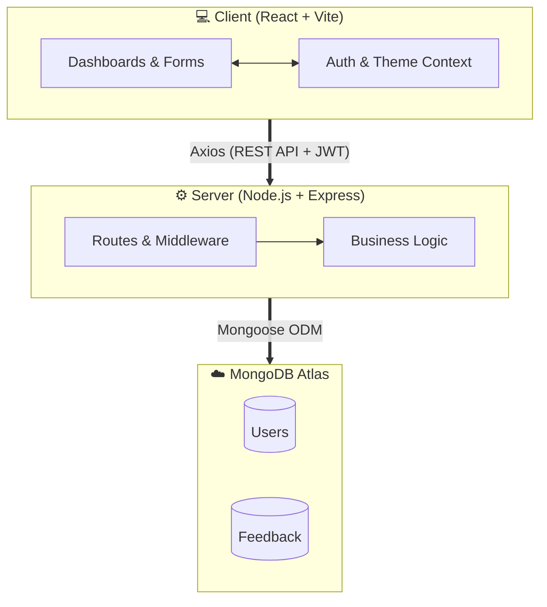

<div align="center">

# &nbsp;&nbsp;Feedback Collector

### A Full-Stack Feedback Management Platform

[](https://himanshu-singh11.github.io/Feedback-Collector)
[](https://feedback-collector-qwv3.onrender.com/health)
[](https://www.mongodb.com/atlas)

A modern, production-ready web application for collecting, managing, and analyzing user feedback. Built with **React**, **Node.js**, **Express**, and **MongoDB** — featuring role-based access control, dark/light themes, glassmorphism UI, and real-time filtering.

---

</div>

## ✨ Key Features

### 👤 For Users
- **Easy Feedback Submission** — Share your thoughts quickly using a simple 5-emoji rating system and a text box.
- **Personal Dashboard** — Keep track of all the feedback you have ever submitted in one clean, organized place.
- **Search & Filter** — Easily find your past feedback by typing keywords or filtering by dates (Today, Last 7 Days, etc.).
- **Account Security** — Secure login system with an easy option to change your password anytime.
- **Dark & Light Mode** — Switch between dark and light themes for a comfortable reading experience.

### 🛡️ For Admins
- **Analytics Overview** — A clear dashboard showing total feedback received, today's submissions, and a breakdown of user ratings.
- **Full Control** — Admins can view, search, filter, and delete feedback submitted by any user on the platform.
- **Live Activity Feed** — See a timeline of the most recent feedback submissions as they happen.
- **Detailed Insights** — Read the complete details of any feedback, including exactly who sent it and when.

### 🎨 Design & Experience
- **Modern Interface** — A beautiful, colorful background with a very clean and professional design.
- **Smooth Animations** — Loading screens and subtle animations make the app feel fast and alive.
- **Instant Notifications** — Helpful pop-up alerts let you know immediately if an action was successful or if there was an error.
- **Mobile Friendly** — Works perfectly and looks great on all devices, from mobile phones to desktop computers.

---

## 🏗️ Architecture



---

## 🛠️ Tech Stack

| Part of Project | Technology Used | Why we used it |
|:---:|:---|:---|
| **Frontend** | React, Vite, React Router | To build a fast, interactive, and seamless user interface. |
| **Design & Styling**| CSS Modules, CSS Variables| To create a beautiful design with smooth Dark & Light modes. |
| **State Management**| React Context API | To remember user login details and theme choices across all pages. |
| **API Client** | Axios | To securely send and receive data between the frontend and the server. |
| **Backend Server** | Node.js, Express.js | To handle all the core logic, secure routes, and process feedback. |
| **Security** | JWT, bcryptjs | To encrypt passwords and safely keep users logged into their accounts. |
| **Database** | MongoDB Atlas, Mongoose | To safely store all the user accounts and feedback data in the cloud. |
| **Hosting** | GitHub Pages & Render | To host the website and server online so anyone can use it. |

---

## 📡 API Endpoints

### Authentication
| Method | Endpoint | Action | Login Required | Who Can Access |
|:---:|:---|:---|:---:|:---|
| `POST` | `/api/auth/register` | Create a new user account | ❌ | Anyone |
| `POST` | `/api/auth/login` | Log in to the application | ❌ | Anyone |
| `GET` | `/api/auth/profile` | View your profile details | ✅ | Logged-in Users |
| `PUT` | `/api/auth/change-password` | Change your password | ✅ | Logged-in Users |

### Feedback
| Method | Endpoint | Action | Login Required | Who Can Access |
|:---:|:---|:---|:---:|:---|
| `GET` | `/api/feedback` | View a list of feedback | ✅ | Users (Own), Admins (All) |
| `GET` | `/api/feedback/:id` | Read a specific feedback | ✅ | Creator & Admins |
| `POST` | `/api/feedback` | Send new feedback | ✅ | Logged-in Users |
| `DELETE` | `/api/feedback/:id` | Delete a feedback message | ✅ | Creator & Admins |

---

## 🔒 Security Implementation


| Security Feature | How it protects the project |
|:---|:---|
| **Encrypted Passwords** | Secures user accounts by encrypting passwords before storing them in the database. |
| **Secure Login Sessions** | Keeps users safely logged in so they can submit feedback without repeatedly typing passwords. |
| **Role-Based Access** | Gives Admins full control of the platform, while restricting regular users to their own personal dashboard. |
| **Feedback Privacy** | Ensures that users can only view, manage, and delete the feedback they personally submitted. |
| **Hidden Data Protection**| Prevents sensitive information (like passwords) from ever being exposed when the app requests data. |
| **Smart Data Validation** | Checks all incoming feedback and email addresses to block fake submissions and harmful code. |
| **Overload Protection** | Limits the size of incoming messages to prevent the server from being slowed down or crashed by spam. |
| **Safe Error Handling** | Displays friendly error messages to users without revealing any internal server secrets. |
| **Automatic Logout** | Automatically signs users out when their session expires to prevent unauthorized access to their account. |

---

## 📁 Project Structure

```
Feedback-Collector/
├── backend/
│   ├── config/
│   │   ├── db.js              # MongoDB connection
│   │   └── env.js             # Environment variable validation
│   ├── controllers/
│   │   ├── authController.js  # Register, Login, Profile, Change Password
│   │   └── feedbackController.js
│   ├── middleware/
│   │   ├── authMiddleware.js  # JWT verify + Role authorization
│   │   ├── errorHandler.js    # Global error handler
│   │   ├── notFound.js        # 404 handler
│   │   └── validateRequest.js # Input validation
│   ├── models/
│   │   ├── Feedback.js        # Feedback schema (indexed)
│   │   └── User.js            # User schema (hashed passwords)
│   ├── routes/
│   │   ├── authRoutes.js
│   │   └── feedbackRoutes.js
│   ├── services/
│   │   └── feedbackService.js # Business logic layer
│   ├── utils/
│   │   ├── ApiError.js        # Custom error class
│   │   └── ApiResponse.js     # Standardized responses
│   ├── app.js                 # Express app configuration
│   └── server.js              # Server entry point
│
├── frontend/
│   ├── src/
│   │   ├── components/
│   │   │   ├── common/        # Reusable UI (Modal, Toast, SearchBar, Skeleton, etc.)
│   │   │   ├── feedback/      # FeedbackForm, FeedbackList, FeedbackItem
│   │   │   └── layout/        # Header, ProfileDropdown
│   │   ├── context/
│   │   │   ├── AuthContext.jsx # JWT + User state management
│   │   │   └── ThemeContext.jsx# Dark/Light mode persistence
│   │   ├── hooks/
│   │   │   └── useFeedbackAPI.js # Custom hook for CRUD operations
│   │   ├── pages/             # Login, Register, Dashboard, AdminDashboard
│   │   ├── services/          # Axios API clients
│   │   ├── styles/
│   │   │   └── global.css     # Design tokens, CSS variables, themes
│   │   └── utils/             # Filtering logic, validation helpers
│   ├── vite.config.js
│   └── package.json
│
├── .gitignore
└── README.md
```

---

## 🚀 Getting Started

### Prerequisites
- **Node.js** v18+ 
- **npm** v9+
- **MongoDB Atlas** account (or local MongoDB)

### 1. Clone the Repository
```bash
git clone https://github.com/Himanshu-Singh11/Feedback-Collector.git
cd Feedback-Collector
```

### 2. Backend Setup
```bash
cd backend
npm install
```

Create a `.env` file in the `backend/` directory:
```env
NODE_ENV=development
PORT=5001
MONGO_URI=mongodb+srv://<username>:<password>@cluster.mongodb.net/feedbackdb?retryWrites=true&w=majority
JWT_SECRET=your_super_secret_key
JWT_EXPIRE=30d
CLIENT_ORIGIN=http://localhost:3000
```

Start the backend server:
```bash
npm run dev
```

### 3. Frontend Setup
```bash
cd ../frontend
npm install
```

Create a `.env` file in the `frontend/` directory:
```env
VITE_API_BASE_URL=http://localhost:5001/api
```

Start the frontend:
```bash
npm run dev
```

### 4. Open in Browser
Navigate to **http://localhost:3000** 🎉

---

## 🌐 Deployment

| Service | Platform | URL |
|:---|:---|:---|
| **Frontend** | GitHub Pages | [himanshu-singh11.github.io/Feedback-Collector](https://himanshu-singh11.github.io/Feedback-Collector) |
| **Backend API** | Render | [feedback-collector-qwv3.onrender.com](https://feedback-collector-qwv3.onrender.com/health) |
| **Database** | MongoDB Atlas | M0 Free Tier (512 MB) |

### Deploy Frontend to GitHub Pages
```bash
cd frontend
VITE_API_BASE_URL=https://feedback-collector-qwv3.onrender.com/api npm run deploy
```

> **Note:** Free Render instances spin down after 15 minutes of inactivity. The first request after idle may take 30-50 seconds (cold start).

---

## 🧪 Test Accounts

| Role | Email | Password |
|:---:|:---|:---|
| **Admin** | `admin@example.com` | `password123` |
| **User** | `user@example.com` | `password123` |

> ⚠️ These accounts need to be created via the Register page. Any email containing "admin" will automatically be assigned the Admin role.

---

## 🤝 Contributing

1. Fork the repository
2. Create your feature branch (`git checkout -b feature/amazing-feature`)
3. Commit your changes (`git commit -m 'Add some amazing feature'`)
4. Push to the branch (`git push origin feature/amazing-feature`)
5. Open a Pull Request

---

## 📄 License

This project is open source and available under the [MIT License](LICENSE).

---

<div align="center">

**Built with ❤️ by [Himanshu Singh](https://github.com/Himanshu-Singh11)**

⭐ Star this repo if you found it helpful!

</div>
