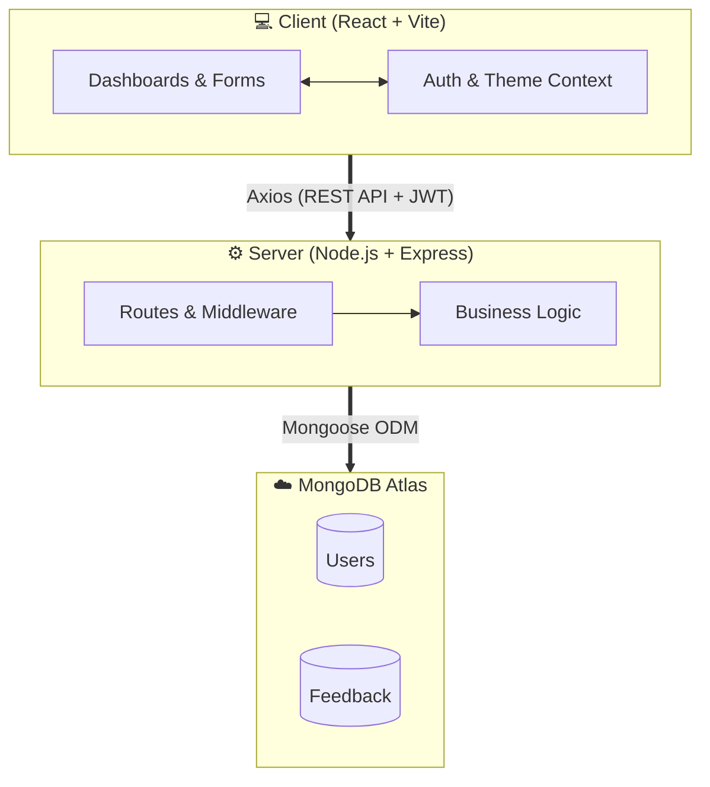
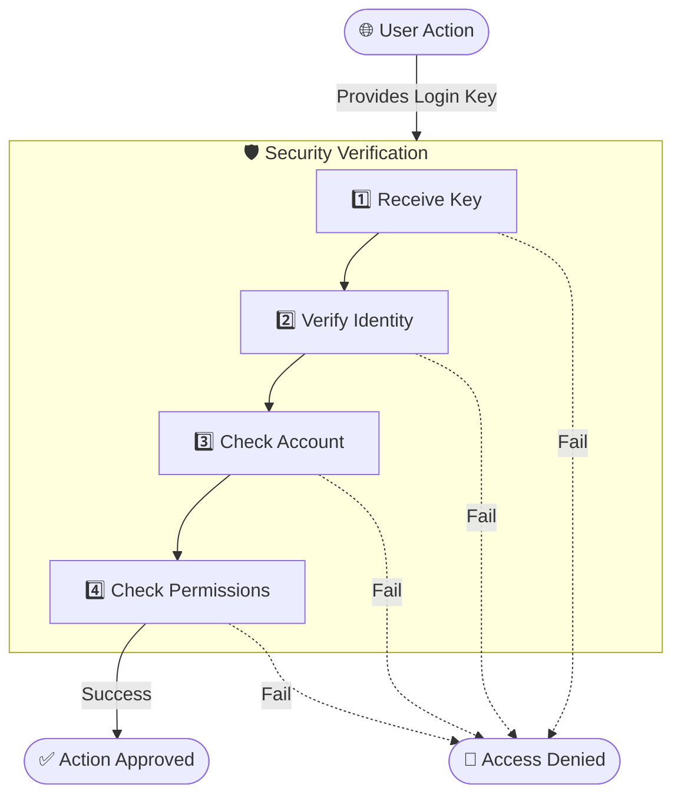

<div align="center">

# &nbsp;&nbsp;Feedback Collector

### A Full-Stack Feedback Management Platform

[](https://himanshu-singh11.github.io/Feedback-Collector)
[](https://feedback-collector-qwv3.onrender.com/health)
[](https://www.mongodb.com/atlas)

A modern, production-ready web application for collecting, managing, and analyzing user feedback. Built with **React**, **Node.js**, **Express**, and **MongoDB** — featuring role-based access control, dark/light themes, glassmorphism UI, and real-time filtering.

---

</div>

## ✨ Key Features

### 👤 For Users
- **Easy Feedback Submission** — Share your thoughts quickly using a simple 5-emoji rating system and a text box.
- **Personal Dashboard** — Keep track of all the feedback you have ever submitted in one clean, organized place.
- **Search & Filter** — Easily find your past feedback by typing keywords or filtering by dates (Today, Last 7 Days, etc.).
- **Account Security** — Secure login system with an easy option to change your password anytime.
- **Dark & Light Mode** — Switch between dark and light themes for a comfortable reading experience.

### 🛡️ For Admins
- **Analytics Overview** — A clear dashboard showing total feedback received, today's submissions, and a breakdown of user ratings.
- **Full Control** — Admins can view, search, filter, and delete feedback submitted by any user on the platform.
- **Live Activity Feed** — See a timeline of the most recent feedback submissions as they happen.
- **Detailed Insights** — Read the complete details of any feedback, including exactly who sent it and when.

### 🎨 Design & Experience
- **Modern Interface** — A beautiful, colorful background with a very clean and professional design.
- **Smooth Animations** — Loading screens and subtle animations make the app feel fast and alive.
- **Instant Notifications** — Helpful pop-up alerts let you know immediately if an action was successful or if there was an error.
- **Mobile Friendly** — Works perfectly and looks great on all devices, from mobile phones to desktop computers.

---

## 🏗️ Architecture



---

## 🛠️ Tech Stack

| Part of Project | Technology Used | Why we used it |
|:---:|:---|:---|
| **Frontend** | React, Vite, React Router | To build a fast, interactive, and seamless user interface. |
| **Design & Styling**| CSS Modules, CSS Variables| To create a beautiful design with smooth Dark & Light modes. |
| **State Management**| React Context API | To remember user login details and theme choices across all pages. |
| **API Client** | Axios | To securely send and receive data between the frontend and the server. |
| **Backend Server** | Node.js, Express.js | To handle all the core logic, secure routes, and process feedback. |
| **Security** | JWT, bcryptjs | To encrypt passwords and safely keep users logged into their accounts. |
| **Database** | MongoDB Atlas, Mongoose | To safely store all the user accounts and feedback data in the cloud. |
| **Hosting** | GitHub Pages & Render | To host the website and server online so anyone can use it. |

---

## 📡 API Endpoints

### Authentication
| Method | Endpoint | Action | Login Required | Who Can Access |
|:---:|:---|:---|:---:|:---|
| `POST` | `/api/auth/register` | Create a new user account | ❌ | Anyone |
| `POST` | `/api/auth/login` | Log in to the application | ❌ | Anyone |
| `GET` | `/api/auth/profile` | View your profile details | ✅ | Logged-in Users |
| `PUT` | `/api/auth/change-password` | Change your password | ✅ | Logged-in Users |

### Feedback
| Method | Endpoint | Action | Login Required | Who Can Access |
|:---:|:---|:---|:---:|:---|
| `GET` | `/api/feedback` | View a list of feedback | ✅ | Users (Own), Admins (All) |
| `GET` | `/api/feedback/:id` | Read a specific feedback | ✅ | Creator & Admins |
| `POST` | `/api/feedback` | Send new feedback | ✅ | Logged-in Users |
| `DELETE` | `/api/feedback/:id` | Delete a feedback message | ✅ | Creator & Admins |

---

## 🔒 Security Implementation



| Security Feature | How it protects the project |
|:---|:---|
| **Encrypted Passwords** | Secures user accounts by encrypting passwords before storing them in the database. |
| **Secure Login Sessions** | Keeps users safely logged in so they can submit feedback without repeatedly typing passwords. |
| **Role-Based Access** | Gives Admins full control of the platform, while restricting regular users to their own personal dashboard. |
| **Feedback Privacy** | Ensures that users can only view, manage, and delete the feedback they personally submitted. |
| **Hidden Data Protection**| Prevents sensitive information (like passwords) from ever being exposed when the app requests data. |
| **Smart Data Validation** | Checks all incoming feedback and email addresses to block fake submissions and harmful code. |
| **Overload Protection** | Limits the size of incoming messages to prevent the server from being slowed down or crashed by spam. |
| **Safe Error Handling** | Displays friendly error messages to users without revealing any internal server secrets. |
| **Automatic Logout** | Automatically signs users out when their session expires to prevent unauthorized access to their account. |

---

## 📁 Project Structure

```text
Feedback-Collector/
├── frontend/                  # 🎨 Main React.js Application
│   ├── src/
│   │   ├── components/        
│   │   │   ├── common/        # Reusable UI (Buttons, Popups, SearchBar)
│   │   │   ├── feedback/      # Core feedback submission forms and lists
│   │   │   └── layout/        # Navbar, Header, and Menus
│   │   ├── context/           # Manages user login state and Dark/Light themes
│   │   ├── pages/             # Main screens: Dashboard, Admin Panel, Login
│   │   ├── services/          # Connects the React app to the backend
│   │   └── styles/            # Modern CSS styling and color themes
│   └── package.json           # Frontend dependencies
│
├── backend/                   # ⚙️ Node.js Server & Database
│   ├── controllers/           # Handles the logic for login and feedback
│   ├── models/                # Database structures for Users and Feedback
│   ├── routes/                # API endpoints (/api/auth, /api/feedback)
│   ├── middleware/            # Security checks and error handling
│   └── server.js              # Main backend server file
│
└── README.md                  # Project documentation
```

---

## 🚀 Getting Started

Follow these simple steps to run the Feedback Collector project locally on your machine.

### 📋 What you need first
- **Node.js** (v18 or newer) — To run the React app and backend server.
- **MongoDB Atlas** (or local MongoDB) — To store user accounts and feedback data.

### 1️⃣ Get the Code
Download the project files to your computer.
```bash
git clone https://github.com/Himanshu-Singh11/Feedback-Collector.git
cd Feedback-Collector
```

### 2️⃣ Start the Backend Server
This sets up the core logic, secures user data, and connects to the database.
```bash
cd backend
npm install
```
Create a `.env` file inside the `backend/` folder and add your database details:
```env
PORT=5001
MONGO_URI=your_mongodb_connection_string_here
JWT_SECRET=your_super_secret_key
JWT_EXPIRE=30d
CLIENT_ORIGIN=http://localhost:3000
```
Start the backend:
```bash
npm run dev
```

### 3️⃣ Start the React Frontend
Now, let's launch the user interface where people will submit their feedback.
Open a **new terminal window** and run:
```bash
cd frontend
npm install
```
Create a `.env` file inside the `frontend/` folder to connect to your local backend:
```env
VITE_API_BASE_URL=http://localhost:5001/api
```
Start the website:
```bash
npm run dev
```

### 4️⃣ Explore the App! 🎉
Open your web browser and visit **http://localhost:3000** to see the Feedback Collector in action.

---

## 🌐 Live Application (Deployment)

This project is fully deployed and accessible online. We split the deployment into three parts to ensure optimal speed and security:

| Part of Project | Hosted On | Live Link / Details |
|:---|:---|:---|
| **User Interface (React)** | GitHub Pages | [Open the Live App](https://himanshu-singh11.github.io/Feedback-Collector) |
| **Backend Server** | Render | Serves API requests securely |
| **Database** | MongoDB Atlas | Cloud database for user data |

### Pushing Updates to the Live Website
If you make changes to the React frontend code and want to update the live website, run this simple command:
```bash
cd frontend
VITE_API_BASE_URL=https://feedback-collector-qwv3.onrender.com/api npm run deploy
```

> **💡 Quick Note on Server Speed:** Our backend is hosted on a free Render tier, which automatically "goes to sleep" if no one uses the app for 15 minutes. When you open the app after a break, it might take **30-50 seconds to wake up**. Please be patient on the first load!

---

## 🧪 Try It Out (Test Accounts)

Want to explore the app without using your real email? You can easily create test accounts to experience different features.

| Access Level | Example Email to Register | Password to Use |
|:---:|:---|:---|
| **Admin Dashboard** | `admin@example.com` | `password123` |
| **Regular User** | `user@example.com` | `password123` |

> **⚠️ Important:** You need to manually sign up on the "Register" page using these details. 
> *Pro Tip:* Our system automatically gives full Admin rights to any newly registered account that has the word **"admin"** inside its email address!

---

## 🤝 Contributing

1. Fork the repository
2. Create your feature branch (`git checkout -b feature/amazing-feature`)
3. Commit your changes (`git commit -m 'Add some amazing feature'`)
4. Push to the branch (`git push origin feature/amazing-feature`)
5. Open a Pull Request

---

## 📄 License

This project is open source and available under the [MIT License](LICENSE).

---

<div align="center">

**Built with ❤️ by [Himanshu Singh](https://github.com/Himanshu-Singh11)**

⭐ Star this repo if you found it helpful!

</div>
